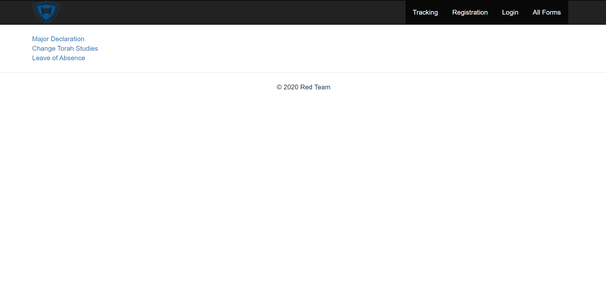
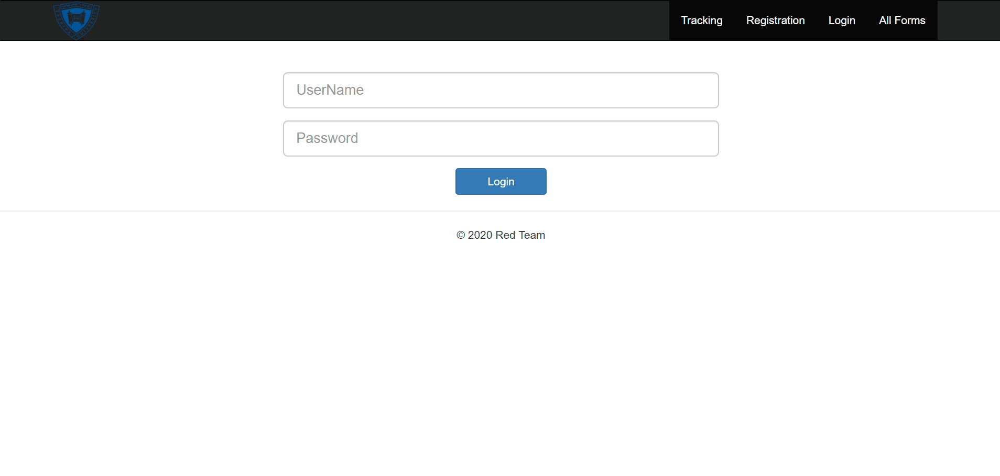

# Spring Boot Form Submission and Approval Workflow Web App


## About
This java-based web app was built for Yeshiva University's registrar office to allow for form 
submission and tracking for students as well as multilevel, dynamic approval workflows for 
deans and administrators. 


## Functionality

### Core Functionality
Students have the ability to fill out and submit a form. On submission, the student receives 
an email confirmation that their form has been received.



The user (dean/administrator/office) who is first in the submitted form's 
unique workflow will receive an email notifying them that they have a form 
to approve. The user can login and view their personal dashboard which lists 
all forms that require their approval and choose to approve, deny, and/or comment 
on each form.



Once approved, the form will either be sent to the next approver or, if the workflow has been completed, the student will receive an email notifying them whether their form has been approved or denied.

### Additional Features 
1. **Form Tracking Page** 
- In their submission confirmation email, student receive a tracking number for their form which they can use to track the status of their form in the workflow and comment on it.
2. **Admin Settings Page**
3. **Query Page**


## Technologies Used
- **Spring Boot**
- **Spring Security** for user authentication
- **Thymeleaf** for dynamic front-end
- **JavaMailSender** for confirmation and reminder emails
- **Spring Data JPA**
- **H2** in-memory database

## How to run

## Helper Tools

### HAL REST Browser

Go to the web browser and visit `http://localhost:8070/`

You will need to be authenticated to be able to see this page.

### H2 Database web interface

Go to the web browser and visit `http://localhost:8070/h2-console`

In field **JDBC URL** put 
```
jdbc:h2:mem:shopping_cart_db